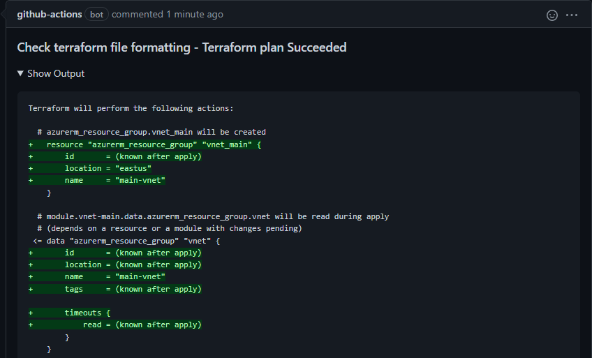

# Terraform Plan action

This is one of a suite of terraform related actions.

This action uses the `terraform fmt` command to check that all terraform files in a terraform configuration directory are in the canonical format.
This can be used to check that files are properly formatted before merging.

If any files are not correctly formatted, the GitHub Action job failed.

A comment will be added to the pull request with the output of the `terraform fmt` in case of error.
Can be removed by adding the input 'Comment' and set the value to false.

## Inputs

* `GitHub_Token`

  GitHub Token used to authenticate on behalf of GitHub Actions.. 

  - Type: string
  - Required

```yaml
        with:
          Github_Token: ${{ secrets.GITHUB_TOKEN }}
```

* `Recursive`

  Process files in subdirectories. By default, only the given directory (or current directory) is processed.

  - Type: boolean
  - Optional
  - Default: true

```yaml
        with:
          Recursive: [true, false]
```

* `Target`

  By default, fmt scans the current directory for configuration files. If you provide a directory for the target argument, then fmt will scan that directory instead. 
 
  - Type: string
  - Optional
  - Default: '.'

```yaml
        with:
          Target: path
```

* `Comment`

  Add pull request comment. By default, this GitHub action will add a comment message to the PR if terraform command failed. 

  - Type: boolean
  - Optional
  - Default: true  

```yaml
        with:
          Comment: [true, false]
```

## Example usage

This example workflow runs on pull request and fails if any of the terraform files are not formatted correctly.

```yaml
name: Check terraform file formatting

on:
  pull_request:

jobs:
  TerraformFormat:
    runs-on: ubuntu-latest
    name: Check terraform file are formatted correctly
    steps:
      - name: Checkout
        uses: actions/checkout@v3

      - name: Setup Terraform
        uses: hashicorp/setup-terraform@v2
        with:
          terraform_wrapper: false

      - name: terraform fmt
        id: fmt
        uses: benyboy84/GitHubAction_terraform-fmt@v1.0.0
        with:
          Github_Token: ${{ secrets.GITHUB_TOKEN }}
          Recursive: true
          Comment: true
```

## Screenshots


